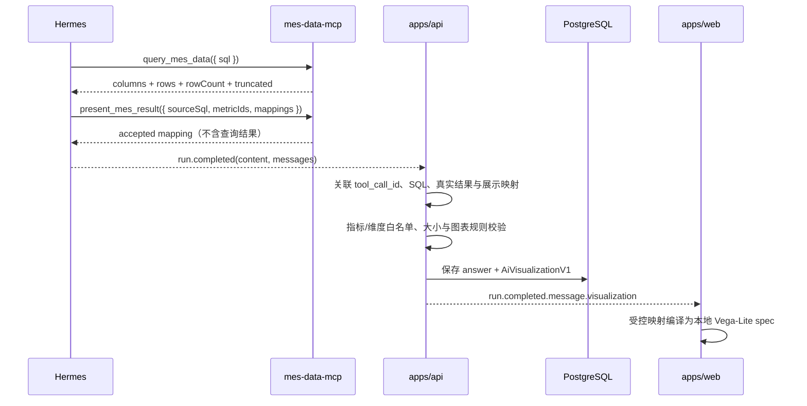

# Hermes MES AI 聚合数据可视化实施计划

> **面向 Agent 执行者：** REQUIRED SUB-SKILL：使用 `superpowers:subagent-driven-development`（推荐）或 `superpowers:executing-plans` 逐任务实施本计划。步骤使用复选框 `- [ ]` 跟踪。

**目标：** 让 Hermes MES AI 在回答完成后自动把已授权的聚合查询结果持久化为 KPI、Vega-Lite 折线图/柱状图和表格，并在历史会话恢复时保持一致展示。

**实现方式：** 新增一个通用 `present_mes_result` MCP 工具，模型只提交受控字段映射，不提交结果值或任意 Vega-Lite JSON。NestJS 从同一次 Hermes 运行的终态 transcript 中关联真实 `query_mes_data` 输出、查询依据和展示请求，校验指标/维度白名单后生成 `AiVisualizationV1` 并保存到助手消息；Web 只把该受控契约编译为本地 Vega-Lite spec，同时始终保留 KPI 与表格降级路径。

**技术栈：** TypeScript 5.9、Zod 4、MCP SDK 1.29、NestJS 11、Prisma 6/PostgreSQL、React 19、Vega 6.2.0、Vega-Lite 6.4.3、vega-embed 7.1.0、Vitest、Testing Library、Playwright。

## 全局约束

- 当前任务按 `L2` 执行，必须在 `.worktrees/codex-hermes-mes-ai-chat` 隔离 worktree 中实施，不得在 `main` / `master` 直接修改。
- 只新增一个通用展示工具；新增图表类型时优先扩展共享契约和通用编译器，不为每种图表新增 MCP 工具。
- 模型不得提交原始 Vega/Vega-Lite JSON、外部 URL、表达式、transform、JavaScript 或任意颜色配置。
- 浏览器不得接收 Hermes 原始 transcript、原始工具结果、reasoning、system prompt、数据库凭据或连接信息。
- PostgreSQL 只持久化经白名单校验的聚合展示结果；MSSQL 原始工具结果仅在当前 API 进程内存中短暂存在，不写日志、不写聊天表、不经 SSE 转发。
- 第一阶段只支持 KPI、`line`、`bar` 和表格；不支持 pie、area、scatter、gauge、Sankey、排序、筛选、导出和流式图表。
- 展示上限固定为：最多 4 个 KPI、12 列、100 行、1 个图表、5 个数值系列、20 个分类值、64 KiB 序列化 JSON；单元格仅允许 `string | number | null`，字符串最长 200 个字符。
- `query_mes_data.truncated === true` 时不生成图表，只保留前 100 行表格和截断提示。
- 单行聚合结果展示 KPI + 表格，不伪造图表；2–100 行时间序列允许折线图；2–20 行分类聚合允许柱状图；空结果、无数值列或分类超过 20 时只展示文本/表格。
- 不新增 REST endpoint 或中间可视化 SSE 事件；`run.completed.message` 和历史消息接口直接携带可选 `visualization`。
- 可视化构建、校验或渲染失败不得把聊天 run 标记失败；回答正文和查询依据仍必须可用。
- 所有新增用户可见文案同步提供 `zh-CN` 与 `en-US`，代码中不写中文文案。
- 数据库命令只读取 `apps/api/.env` 中的 `DATABASE_URL`，不得把实际连接串或密码写入计划、代码、日志和提交。
- 既有 Web 全量测试基线为 7 个测试文件、21 个用例失败；实施时必须运行 AI Chat 定向测试，并把全量结果与该基线对比，不得把既有失败描述为本任务通过。

---

## 已确认的运行时数据流



## 共享契约

展示请求与持久化结果使用 `packages/ai-visualization-contract` 作为唯一契约来源：

```ts
export type MesScalar = string | number | null;
export type MesValueFormat = "integer" | "decimal" | "percent";

export type MesFieldBinding = {
  field: string;
  label: string;
};

export type MesMetricBinding = MesFieldBinding & {
  format: MesValueFormat;
};

export type MesDimensionBinding = MesFieldBinding & {
  type: "temporal" | "nominal";
};

export type MesPresentationRequestV1 = {
  specVersion: 1;
  sourceSql: string;
  metricIds: string[];
  title: string;
  kpis: MesMetricBinding[];
  table: { columns: Array<MesMetricBinding | MesDimensionBinding> };
  chart?: {
    mark: "line" | "bar";
    x: MesDimensionBinding;
    y: MesMetricBinding[];
    series?: MesDimensionBinding;
  };
};

export type AiVisualizationV1 = {
  specVersion: 1;
  sourceEvidenceId: string;
  metricIds: string[];
  title: string;
  kpis: MesMetricBinding[];
  table: { columns: Array<MesMetricBinding | MesDimensionBinding> };
  chart?: MesPresentationRequestV1["chart"];
  data: {
    rows: Array<Record<string, MesScalar>>;
    truncated: boolean;
  };
};
```

约束补充：`chart.series` 仅在 `chart.y.length === 1` 时允许；多数值列通过 `y` 的 1–5 个字段表达，单数值列按分类分组时通过 `series` 表达。Web 在内存中把两种形式归一化为 `{ x, series, value }`，无需开放 Vega transform。

## 文件清单

### 新建

- `packages/ai-visualization-contract/package.json`
- `packages/ai-visualization-contract/tsconfig.json`
- `packages/ai-visualization-contract/src/index.ts`
- `packages/ai-visualization-contract/src/index.test.ts`
- `apps/api/src/ai-chat/hermes/presentation-transcript.ts`
- `apps/api/src/ai-chat/hermes/presentation-transcript.test.ts`
- `apps/api/src/ai-chat/presentation/ai-visualization-materializer.ts`
- `apps/api/src/ai-chat/presentation/ai-visualization-materializer.test.ts`
- `apps/web/src/features/ai-chat/ai-visualization.tsx`
- `apps/web/src/features/ai-chat/ai-visualization.test.tsx`
- `apps/web/src/features/ai-chat/vega-lite-spec.ts`
- `apps/web/src/features/ai-chat/vega-lite-spec.test.ts`

### 修改

- `apps/api/config/ai/mes/metrics.yaml`
- `apps/api/config/ai/mes/prompt.md`
- `apps/api/prisma/schema.prisma`
- `apps/api/package.json`
- `apps/api/src/ai-chat/ai-chat.module.ts`
- `apps/api/src/ai-chat/ai-chat.repository.ts`
- `apps/api/src/ai-chat/ai-chat.repository.test.ts`
- `apps/api/src/ai-chat/ai-chat.service.ts`
- `apps/api/src/ai-chat/ai-chat.service.test.ts`
- `apps/api/src/ai-chat/ai-chat.types.ts`
- `apps/api/src/ai-chat/context/mes-context.service.ts`
- `apps/api/src/ai-chat/context/mes-context.service.test.ts`
- `apps/api/src/ai-chat/hermes/hermes-client.ts`
- `apps/api/src/ai-chat/hermes/hermes-client.test.ts`
- `apps/mes-data-mcp/package.json`
- `apps/mes-data-mcp/src/tools.ts`
- `apps/mes-data-mcp/src/tools.test.ts`
- `apps/web/package.json`
- `apps/web/src/features/ai-chat/ai-chat-contract.ts`
- `apps/web/src/features/ai-chat/ai-chat-sheet.test.tsx`
- `apps/web/src/features/ai-chat/message-list.tsx`
- `apps/web/src/i18n/resources/en-US/common.ts`
- `apps/web/src/i18n/resources/zh-CN/common.ts`
- `apps/web-e2e/fixtures/ai-chat-context/metrics.yaml`
- `apps/web-e2e/fixtures/ai-chat-context/prompt.md`
- `apps/web-e2e/helpers/fake-hermes-server.ts`
- `apps/web-e2e/tests/ai-chat.spec.ts`
- `docs/ai/context-index.md`
- `pnpm-lock.yaml`

---

### 任务 1：TDD 建立受控可视化共享契约

**文件：**

- 新建：`packages/ai-visualization-contract/package.json`
- 新建：`packages/ai-visualization-contract/tsconfig.json`
- 新建：`packages/ai-visualization-contract/src/index.ts`
- 新建：`packages/ai-visualization-contract/src/index.test.ts`
- 修改：`apps/api/package.json`
- 修改：`apps/mes-data-mcp/package.json`
- 修改：`apps/web/package.json`
- 修改：`pnpm-lock.yaml`

**接口：**

- 输入：`mesPresentationRequestV1Schema.safeParse(unknown)`。
- 输出：`MesPresentationRequestV1`、`AiVisualizationV1`、`aiVisualizationV1Schema` 及固定限制常量。
- 后续任务只能从该包导入契约，禁止在 API、MCP 和 Web 各自复制 union。

- [ ] **步骤 1：先写共享契约失败测试**

在 `src/index.test.ts` 写表驱动用例，至少覆盖：合法 table-only、合法 line、合法 bar、pie 被拒绝、额外属性被拒绝、5 个以上 y 字段被拒绝、series 与多个 y 同时出现被拒绝、4 个以上 KPI 被拒绝、12 列以上被拒绝、空 metricIds 被拒绝、字段名不符合 `/^[A-Za-z_][A-Za-z0-9_]*$/` 被拒绝、字符串单元格超过 200 被拒绝、`NaN`/`Infinity` 被拒绝。

```ts
expect(
  mesPresentationRequestV1Schema.safeParse({
    specVersion: 1,
    sourceSql: "SELECT ReportDate AS date, SUM(GoodQty) AS dailyOutput",
    metricIds: ["daily_output"],
    title: "Daily output trend",
    kpis: [],
    table: {
      columns: [
        { field: "date", label: "Date", type: "temporal" },
        { field: "dailyOutput", label: "Daily output", format: "integer" },
      ],
    },
    chart: {
      mark: "line",
      x: { field: "date", label: "Date", type: "temporal" },
      y: [{ field: "dailyOutput", label: "Daily output", format: "integer" }],
    },
  }).success,
).toBe(true);
```

- [ ] **步骤 2：运行测试，确认 RED**

执行：

```bash
pnpm --filter @repo/ai-visualization-contract test
```

预期：失败，提示 workspace package 或 schema 尚不存在。

- [ ] **步骤 3：实现最小共享包**

`package.json` 固定导出源码并提供 `test`、`typecheck`、`lint`、`build` scripts；依赖固定为 `zod@4.4.3`。`src/index.ts` 定义本计划“共享契约”中的类型、严格 Zod schema 和以下常量：

```ts
export const AI_VISUALIZATION_LIMITS = {
  kpis: 4,
  columns: 12,
  rows: 100,
  serializedBytes: 64 * 1024,
  charts: 1,
  numericSeries: 5,
  categories: 20,
  cellStringLength: 200,
} as const;
```

所有 object schema 使用 `.strict()`；数组在 schema 层直接限制长度；`AiVisualizationV1` 的 data row 只接受共享 scalar schema。

- [ ] **步骤 4：运行共享包验证**

执行：

```bash
pnpm install
pnpm --filter @repo/ai-visualization-contract test
pnpm --filter @repo/ai-visualization-contract typecheck
pnpm --filter @repo/ai-visualization-contract lint
```

预期：共享包测试全部通过，三个消费者能解析 workspace 依赖，不出现重复 Zod 版本类型错误。

- [ ] **步骤 5：提交契约切片**

```bash
git add packages/ai-visualization-contract apps/api/package.json apps/mes-data-mcp/package.json apps/web/package.json pnpm-lock.yaml
git commit -m "feat(ai): add visualization contract"
```

---

### 任务 2：TDD 增加展示策略配置和通用 MCP 工具

**文件：**

- 修改：`apps/api/config/ai/mes/metrics.yaml`
- 修改：`apps/api/config/ai/mes/prompt.md`
- 修改：`apps/api/src/ai-chat/context/mes-context.service.ts`
- 修改：`apps/api/src/ai-chat/context/mes-context.service.test.ts`
- 修改：`apps/mes-data-mcp/src/tools.ts`
- 修改：`apps/mes-data-mcp/src/tools.test.ts`

**接口：**

```ts
export type MesPresentationPolicy = {
  metrics: ReadonlyMap<string, {
    field: string;
    label: string;
    format: "integer" | "decimal" | "percent";
  }>;
  dimensions: ReadonlyMap<string, {
    label: string;
    type: "temporal" | "nominal";
  }>;
};

MesContextService.getPresentationPolicy(): MesPresentationPolicy;
```

- [ ] **步骤 1：先写配置与 MCP 失败测试**

配置测试新增断言：每个 required metric 都必须有唯一的 `presentation.field`、非空 `label` 和受支持 `format`；`presentationDimensions` 字段唯一且只允许 temporal/nominal。MCP 测试新增：`present_mes_result` 接受合法共享请求、拒绝 `mark: "pie"`、拒绝未知属性，并断言 handler 不调用 `database.query`。

```ts
await expect(
  handlers.presentMesResult(validPresentationRequest),
).resolves.toEqual({
  content: [{
    type: "text",
    text: JSON.stringify({ accepted: true, request: validPresentationRequest }),
  }],
});
expect(database.query).not.toHaveBeenCalled();
```

- [ ] **步骤 2：运行测试，确认 RED**

执行：

```bash
pnpm --filter @repo/api test -- mes-context.service
pnpm --filter @repo/mes-data-mcp test -- tools
```

预期：失败，提示 presentation 配置、policy getter 和工具 handler 尚不存在。

- [ ] **步骤 3：扩展指标配置和上下文校验**

在 `metrics.yaml` 为现有指标加入：

```yaml
presentationDimensions:
  - field: date
    label: Date
    type: temporal
  - field: category
    label: Category
    type: nominal
  - field: series
    label: Series
    type: nominal

metrics:
  - id: daily_output
    presentation:
      field: dailyOutput
      label: Daily output
      format: integer
  - id: daily_completed_work_orders
    presentation:
      field: completedWorkOrders
      label: Completed work orders
      format: integer
```

保留现有 metric 字段不变；`MesContextService` 在启动时拒绝重复字段和未知格式，并通过 `getPresentationPolicy()` 返回深冻结的只读配置。

- [ ] **步骤 4：注册唯一展示工具并收紧 prompt**

`registerMesTools` 新增且只新增以下工具：

```ts
server.registerTool(
  "present_mes_result",
  {
    description: "Describe a controlled KPI, line/bar chart, and table presentation for the most recent MES aggregate query result.",
    inputSchema: mesPresentationRequestV1Schema.shape,
  },
  handlers.presentMesResult,
);
```

`prompt.md` 明确要求：查询列必须使用 presentation 配置中的稳定 alias；获得最终聚合查询结果后调用一次 `present_mes_result`；`sourceSql` 必须逐字符复制对应 `query_mes_data.sql`；不传结果值；不请求未支持图表；无法满足规则时使用 table-only；明细行、敏感字段和 truncated 结果不得生成图表。

- [ ] **步骤 5：运行验证并提交**

执行：

```bash
pnpm --filter @repo/api test -- mes-context.service
pnpm --filter @repo/mes-data-mcp test -- tools
pnpm --filter @repo/mes-data-mcp typecheck
pnpm --filter @repo/mes-data-mcp lint
```

预期：所有定向测试通过，现有 `describe_mes_schema` 和 `query_mes_data` 契约不变。

```bash
git add apps/api/config/ai/mes apps/api/src/ai-chat/context apps/mes-data-mcp/src/tools.ts apps/mes-data-mcp/src/tools.test.ts
git commit -m "feat(ai): add controlled presentation tool"
```

---

### 任务 3：TDD 解析 Hermes 终态 transcript 并关联工具调用

**文件：**

- 修改：`apps/api/src/ai-chat/hermes/hermes-client.ts`
- 修改：`apps/api/src/ai-chat/hermes/hermes-client.test.ts`
- 新建：`apps/api/src/ai-chat/hermes/presentation-transcript.ts`
- 新建：`apps/api/src/ai-chat/hermes/presentation-transcript.test.ts`

**接口：**

```ts
export type HermesTranscriptMessage = {
  role: string;
  content: unknown;
  toolCallId?: string;
  toolCalls?: Array<{
    id: string;
    name: string;
    arguments: unknown;
  }>;
};

export type HermesRunCompletedEvent = {
  type: "run.completed";
  content: string;
  messages: HermesTranscriptMessage[];
};

export type ExtractedPresentation = {
  request: MesPresentationRequestV1;
  query: {
    sql: string;
    columns: string[];
    rows: Array<Record<string, unknown>>;
    rowCount: number;
    truncated: boolean;
  };
};

export function extractPresentations(
  messages: readonly HermesTranscriptMessage[],
): ExtractedPresentation[];
```

- [ ] **步骤 1：先写终态事件解析失败测试**

构造当前 Hermes 0.18.2 形状的 `run.completed`：assistant message 含 snake_case `tool_calls`，tool message 含 `tool_call_id`，函数 arguments 为 JSON 字符串。覆盖 payload 同时有/没有顶层 content、未知 transcript 字段忽略、畸形 messages 不泄露原始 payload、旧 `{ content }` 事件仍兼容。

```ts
expect(events.at(-1)).toMatchObject({
  type: "run.completed",
  content: "Final answer",
  messages: expect.arrayContaining([
    expect.objectContaining({ role: "tool", toolCallId: "call-query" }),
  ]),
});
```

- [ ] **步骤 2：先写工具关联失败测试**

覆盖：按 tool call ID 关联 query 调用与结果；识别 `mcp__mes_data__query_mes_data` 和 `mcp_mes_data_query_mes_data`；识别同样两种前缀的 `present_mes_result`；支持 tool content 为直接 JSON 文本或 MCP `{ content: [{ type: "text", text }] }` 包装；多个查询只关联 `sourceSql` 完全相等的一个；缺失结果、重复 tool_call_id、SQL 不匹配、展示请求不合法时返回空数组；不得从 `tool.completed.preview` 猜测行数据。

- [ ] **步骤 3：实现最小 transcript 白名单解析**

`run.completed` 只保留 `role`、`content`、`tool_call_id`、`tool_calls[].id`、`function.name` 和 `function.arguments`。最终正文优先使用顶层 `content`；没有时取最后一条非 tool assistant 文本。禁止把 `messages` 放入公开 DTO、broker 事件或日志。

- [ ] **步骤 4：实现确定性关联器**

关联顺序固定为：解析 assistant tool call → 用 `tool_call_id` 找对应 tool result → 解析严格 query result shape → 解析 presentation request → 用 `request.sourceSql === query.sql` 配对。返回值仍是内存对象，不做持久化。

- [ ] **步骤 5：运行验证并提交**

执行：

```bash
pnpm --filter @repo/api test -- hermes-client presentation-transcript
pnpm --filter @repo/api typecheck
pnpm --filter @repo/api lint
```

预期：新旧 Hermes 终态事件都通过；畸形 transcript 只跳过可视化，不中断正文完成路径。

```bash
git add apps/api/src/ai-chat/hermes
git commit -m "feat(api): extract Hermes presentation transcript"
```

---

### 任务 4：TDD 校验、持久化并发布 `AiVisualizationV1`

**文件：**

- 修改：`apps/api/prisma/schema.prisma`
- 修改：`apps/api/src/ai-chat/ai-chat.types.ts`
- 修改：`apps/api/src/ai-chat/ai-chat.repository.ts`
- 修改：`apps/api/src/ai-chat/ai-chat.repository.test.ts`
- 修改：`apps/api/src/ai-chat/ai-chat.service.ts`
- 修改：`apps/api/src/ai-chat/ai-chat.service.test.ts`
- 修改：`apps/api/src/ai-chat/ai-chat.module.ts`
- 新建：`apps/api/src/ai-chat/presentation/ai-visualization-materializer.ts`
- 新建：`apps/api/src/ai-chat/presentation/ai-visualization-materializer.test.ts`

**接口：**

```ts
export type MaterializeVisualizationInput = {
  extracted: ExtractedPresentation[];
  evidence: AiQueryEvidenceDto[];
  policy: MesPresentationPolicy;
};

export function materializeVisualization(
  input: MaterializeVisualizationInput,
): AiVisualizationV1 | undefined;

AiChatRepository.completeRun(
  runId: string,
  content: string,
  visualization?: AiVisualizationV1,
): Promise<AiMessageDto>;
```

- [ ] **步骤 1：先写 materializer 失败测试**

逐项覆盖以下决策表：

| 输入 | 预期 |
| --- | --- |
| 1 行、合法 metric、KPI + table | 保留 KPI 与 table，移除 chart |
| 2–100 行 temporal x、数值 y、line | 保留 line |
| 2–20 行 nominal x、数值 y、bar | 保留 bar |
| line + nominal x 或 bar + temporal x | 移除 chart，保留 table |
| 分类值超过 20、无数值 y、空 rows | 移除 chart |
| query truncated | 最多 100 行、`data.truncated=true`、无 chart |
| 未声明 metricId、未知字段、字段类型不符 | 整个 visualization 返回 undefined |
| sourceSql 未匹配同 run completed evidence | 返回 undefined |
| 100 行以上或单元格字符串超过 200 | 截取到上限并标记 truncated |
| JSON 超过 64 KiB | 从尾部逐行缩减；仍超限则返回 undefined |

断言 materializer 只选择最后一个完全合法的展示请求，且不改变输入对象。

- [ ] **步骤 2：实现白名单与降级规则**

验证顺序固定为：

1. `sourceSql` 完全匹配同一 run 的 `completed` evidence，并记录其 `id` 为 `sourceEvidenceId`。
2. `metricIds` 全部存在于 policy；KPI/y 字段只能是这些 metric 的 `presentation.field`。
3. x/series 字段只能来自 `presentationDimensions`；table 字段只能来自已声明 metric 或 dimension。
4. 所有映射字段必须存在于 query columns；metric 单元格必须是有限 number；scalar/string 限制必须成立。
5. 应用行数、分类数、图表类型、truncated 和 64 KiB 规则；任何异常返回 `undefined`，不得抛出到 run 状态机。

- [ ] **步骤 3：先写 Prisma/DTO 持久化失败测试**

在 `AiMessage` 增加 nullable JSON：

```prisma
model AiMessage {
  visualization Json?
}
```

测试 `completeRun` 在同一 Prisma update 中保存 content、completed 状态和 visualization；`listMessages` 能恢复；旧消息 null 时 DTO 不输出或输出 `undefined`；畸形数据库 JSON 不进入 Web DTO。

- [ ] **步骤 4：接入 run 完成路径**

`HermesStreamEvent.run.completed` 到达时：

1. 调用 `extractPresentations(event.messages)`。
2. 读取当前 run 已完成 evidence。
3. 调用 materializer；失败或 `undefined` 只省略 visualization。
4. `completeRun` 返回持久化后的 message DTO。
5. broker 发布该 DTO；不新增 `visualization.updated` 事件。

公开类型只增加：

```ts
export type AiMessageDto = {
  // existing fields
  visualization?: AiVisualizationV1;
};
```

- [ ] **步骤 5：生成 Prisma client 并运行 API 验证**

执行：

```bash
pnpm --filter @repo/api prisma:generate
pnpm --filter @repo/api test -- ai-visualization-materializer ai-chat.repository ai-chat.service ai-chat.controller
pnpm --filter @repo/api typecheck
pnpm --filter @repo/api lint
pnpm --filter @repo/api build
```

预期：定向测试全部通过；公开 SSE 不包含 `messages`、原始 rows 或工具 envelope，只包含受限 `visualization`。

- [ ] **步骤 6：人工确认后应用 nullable 列并提交**

从仓库根目录执行；Prisma 读取 `apps/api/.env` 的 `DATABASE_URL`：

```bash
pnpm --filter @repo/api db:push
```

预期：只为 `AiMessage` 增加 nullable JSON 列，不删除或重建既有 AI 数据。

```bash
git add apps/api/prisma/schema.prisma apps/api/src/ai-chat apps/api/package.json pnpm-lock.yaml
git commit -m "feat(api): persist AI visualizations"
```

---

### 任务 5：TDD 实现通用 Vega-Lite 编译器和展示组件

**文件：**

- 新建：`apps/web/src/features/ai-chat/vega-lite-spec.ts`
- 新建：`apps/web/src/features/ai-chat/vega-lite-spec.test.ts`
- 新建：`apps/web/src/features/ai-chat/ai-visualization.tsx`
- 新建：`apps/web/src/features/ai-chat/ai-visualization.test.tsx`
- 修改：`apps/web/package.json`
- 修改：`pnpm-lock.yaml`

**接口：**

```ts
export function compileVegaLiteSpec(
  visualization: AiVisualizationV1,
): TopLevelSpec | undefined;

export function AiVisualization(props: {
  visualization: AiVisualizationV1;
}): React.JSX.Element;
```

- [ ] **步骤 1：先写 Vega spec 编译失败测试**

覆盖 line、bar、多 y 字段、单 y + series、无 chart 返回 undefined。断言输出只含 inline `data.values`、固定 mark 和 encoding；递归断言不含 `url`、`href`、`expr`、`transform`、`calculate`、`signal`；不把用户 title/label 当作字段名。

```ts
expect(compileVegaLiteSpec(lineVisualization)).toMatchObject({
  mark: { type: "line", tooltip: true },
  data: { values: expect.any(Array) },
  encoding: {
    x: { field: "x", type: "temporal" },
    y: { field: "value", type: "quantitative" },
    color: { field: "series", type: "nominal" },
  },
});
```

- [ ] **步骤 2：实现纯函数编译器**

编译器先把受控 rows 转为 `{ x, series, value }`。`mark`、encoding field 和 type 全部由代码常量生成；用户映射只用于从已验证 rows 取值以及显示 label。配置固定 `width: "container"`、`height: 220`、响应式 resize、可访问 description 和本地 tooltip，不开放 Vega config 透传。

- [ ] **步骤 3：先写 UI 失败测试**

mock `vega-embed`，覆盖：4 个以内 KPI；表格列顺序和格式化；水平滚动容器；truncated 提示；有图表时 embed 调用一次；无图表不调用；embed reject 时显示本地化提示且表格仍存在；unmount 调用 `view.finalize()`；旧/畸形 visualization 不让整条消息崩溃。

- [ ] **步骤 4：安装固定依赖并实现组件**

执行：

```bash
pnpm --filter @repo/web add --save-exact vega@6.2.0 vega-lite@6.4.3 vega-embed@7.1.0
```

`AiVisualization` 垂直渲染：KPI grid → 图表容器 → table。表格复用 `apps/web/src/components/ui/table.tsx`，外层 `max-w-full overflow-x-auto`；数字使用当前 locale 的 `Intl.NumberFormat`。图表使用 `vega-embed`，禁用 actions；同步编译错误由局部 Error Boundary 隐藏图表，异步 embed 错误在组件内捕获；两者都只显示 `aiChat.visualizationUnavailable`，不隐藏 KPI/表格。

- [ ] **步骤 5：运行 Web 定向验证并提交**

执行：

```bash
pnpm --filter @repo/web test -- vega-lite-spec ai-visualization
pnpm --filter @repo/web typecheck
pnpm --filter @repo/web lint
pnpm --filter @repo/web build
```

预期：编译器和组件测试全部通过；生产 bundle 不发起外部数据请求。

```bash
git add apps/web/src/features/ai-chat/vega-lite-spec.ts apps/web/src/features/ai-chat/vega-lite-spec.test.ts apps/web/src/features/ai-chat/ai-visualization.tsx apps/web/src/features/ai-chat/ai-visualization.test.tsx apps/web/package.json pnpm-lock.yaml
git commit -m "feat(web): render controlled AI visualizations"
```

---

### 任务 6：TDD 接入消息布局、终态刷新和多语言

**文件：**

- 修改：`apps/web/src/features/ai-chat/ai-chat-contract.ts`
- 修改：`apps/web/src/features/ai-chat/message-list.tsx`
- 修改：`apps/web/src/features/ai-chat/ai-chat-sheet.test.tsx`
- 修改：`apps/web/src/i18n/resources/zh-CN/common.ts`
- 修改：`apps/web/src/i18n/resources/en-US/common.ts`

**接口：**

```ts
export type AiMessage = {
  // existing fields
  visualization?: AiVisualizationV1;
};
```

- [ ] **步骤 1：先写消息级展示失败测试**

测试最终 assistant message 的内容顺序为 Markdown 摘要 → KPI → 图表 → 表格；user message 不渲染 visualization；streaming delta 期间不渲染；`run.completed` 携带 visualization 时无需等待第二次 history fetch 即可出现；刷新后从 `listAiMessages` 恢复同一展示；旧消息无 visualization 时保持原样。

- [ ] **步骤 2：实现契约与消息内布局**

`MessageList` 在每条 assistant `<article>` 内部、Markdown 之后按条件渲染：

```tsx
{message.role === "assistant" && message.status === "completed" && message.visualization ? (
  <AiVisualization visualization={message.visualization} />
) : null}
```

不得把可视化移到消息列表尾部；查询依据仍按现有逻辑折叠展示。`AiChatSheet` 的终态合并必须保留 `event.message.visualization`，不能只复制 content/status。

- [ ] **步骤 3：补齐中英文文案**

新增键：`visualizationUnavailable`、`visualizationTruncated`、`visualizationTableLabel`、`visualizationChartLabel`。中文与英文分别提供自然文案；测试通过 i18n key 访问，不在组件中写语言判断。

- [ ] **步骤 4：运行 AI Chat 定向验证**

执行：

```bash
pnpm --filter @repo/web test -- ai-chat-sheet ai-visualization message-list
pnpm --filter @repo/web typecheck
pnpm --filter @repo/web lint
pnpm --filter @repo/web build
```

预期：AI Chat 定向测试全部通过，无 act warning；桌面 440px Sheet 和移动端均不产生页面级横向溢出。

- [ ] **步骤 5：提交消息集成切片**

```bash
git add apps/web/src/features/ai-chat apps/web/src/i18n/resources/zh-CN/common.ts apps/web/src/i18n/resources/en-US/common.ts
git commit -m "feat(web): show AI charts in messages"
```

---

### 任务 7：确定性 E2E、真实链路验收和最终审计

**文件：**

- 修改：`apps/web-e2e/fixtures/ai-chat-context/metrics.yaml`
- 修改：`apps/web-e2e/fixtures/ai-chat-context/prompt.md`
- 修改：`apps/web-e2e/helpers/fake-hermes-server.ts`
- 修改：`apps/web-e2e/tests/ai-chat.spec.ts`
- 修改：`docs/ai/context-index.md`

- [ ] **步骤 1：扩展 fake Hermes transcript**

fake server 的正常场景发送真实结构的 `run.completed.messages`：包含 `query_mes_data` 调用/结果和 `present_mes_result` 调用/结果，查询数据固定为 7 天聚合。另增加场景：单行 KPI、分类柱状图、pie 请求被工具拒绝后 table-only、truncated 结果、展示工具缺失、畸形 transcript。正文仍使用既有稳定文案，避免 E2E 依赖模型措辞。

- [ ] **步骤 2：先写 E2E 失败断言**

用角色和稳定文案断言：

- 正常回答出现 KPI、`img`/可访问 chart label 和 table。
- 页面刷新后 visualization 仍存在。
- 单行结果没有 chart，但有 KPI 和 table。
- truncated、unsupported、工具缺失和 Vega 失败时正文/table 可用，run 不显示失败。
- 浏览器响应与 DOM 不含 `messages`、`tool_call_id`、原始未授权列、password 或 API key。
- Sheet 及 document 在桌面/移动 viewport 无页面级横向溢出。

- [ ] **步骤 3：运行确定性 E2E**

执行：

```bash
pnpm --filter @repo/web-e2e test:e2e:ai-chat
```

预期：AI Chat E2E 全部通过，且截图/trace 中不出现 transcript 或凭据。

- [ ] **步骤 4：人工批准后执行真实 Hermes/MSSQL 验收**

保持专用 `mes-data-analyst` Profile 和只读 `analysis_reader` 权限不变。用固定问题验证：单值今日产量、最近 7 天产量趋势、按允许维度分组的完成工单数。验收数值与人工 SQL 一致，刷新后保持展示；模型请求不支持图表时降级，不修改 MCP 或 Web 代码来适配单次回答。

- [ ] **步骤 5：运行最终验证并记录既有基线**

执行：

```bash
pnpm --filter @repo/ai-visualization-contract test
pnpm --filter @repo/mes-data-mcp test
pnpm --filter @repo/api test
pnpm --filter @repo/web test -- ai-chat vega-lite-spec ai-visualization
pnpm --filter @repo/web-e2e test:e2e:ai-chat
pnpm lint
pnpm typecheck
pnpm build
pnpm --filter @repo/web test
```

预期：新共享包、MCP、API、AI Chat 定向测试、确定性 E2E、lint、typecheck、build 全部通过。Web 全量测试若仍为已记录的 `7 failed files / 21 failed tests`，在本计划“执行记录”追加实际时间和文件清单；若失败数或失败位置增加，先修复新增回归再继续。

- [ ] **步骤 6：执行安全与差异审计**

执行：

```bash
git diff --check
git status --short
rg -n "tool_call_id|run\.completed.*messages|HERMES_API_KEY=.+|MES_DB_PASSWORD=.+" apps packages docs --glob '!*.test.*' --glob '!*.example'
```

预期：除 Hermes 内部白名单解析代码外，公开 contract、Web、日志和文档中无 transcript 字段或真实凭据；`apps/web/.env.local` 的既有用户修改不在提交范围内。

- [ ] **步骤 7：更新导航并提交验收切片**

`docs/ai/context-index.md` 的 MES AI Chat 锚点增加本计划链接和最窄验证命令。

```bash
git add apps/web-e2e docs/ai/context-index.md
git commit -m "test(ai): verify persisted MES visualizations"
```

---

## 完成验收

- Hermes 只有一个通用 `present_mes_result` 展示工具，且不读取数据库、不接收结果值、不接受任意 Vega spec。
- API 只使用同一次 run 的真实 query tool output，`sourceSql` 与 completed evidence 完全匹配后才生成 visualization。
- 持久化数据只包含已批准的聚合 metric/dimension alias，并满足 4 KPI、12 列、100 行、64 KiB 等限制。
- assistant 正文完成后按 Markdown → KPI → chart → table 顺序展示；历史消息刷新恢复一致。
- line/bar 之外的类型在工具契约层拒绝；任何展示错误都降级，聊天正文、table 和 evidence 不受影响。
- Web 生成的 Vega-Lite spec 不含外部 URL、表达式、transform 或任意脚本入口。
- 新增文案具备中英文，桌面与移动端无页面级横向溢出。
- 所有定向测试、E2E 和构建有实际通过证据；Web 既有基线失败被单独记录且没有新增失败。

## 非目标

- 不实现 pie、area、scatter、gauge、Sankey 或模型自定义图表插件。
- 不实现排序、筛选、分页、导出、钻取、联动或实时流式更新图表。
- 不持久化工单、物料、人员等明细结果，也不把原始 MSSQL 工具结果返回浏览器。
- 不新增图表专用 REST API、WebSocket/SSE 事件或独立图表服务。
- 不修改 `analysis_reader` 权限、Hermes default Profile、现有会话归属与租户安全模型。

## 执行记录

### 已知 Web 全量测试基线

沿用 2026-07-13 已记录基线：

- Test Files：`7 failed | 77 passed (84)`
- Tests：`21 failed | 587 passed (608)`
- Unhandled Errors：`8 errors`
- 失败集中在既有 Data Export 尺寸断言和包装基础数据页面交互/通知断言，不位于 AI Chat 路径。

实施本计划时必须重新运行并记录实际结果；本段不等同于本次可视化变更的验证通过证据。
