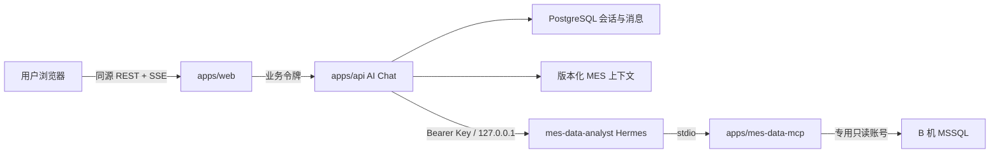

# Hermes MES AI 聊天设计

日期：2026-07-13

## 背景

项目需要在现有管理后台中增加全局 AI 聊天入口。用户点击顶部栏入口后，在右侧聊天抽屉中基于 MES 业务知识和 B 机 MSSQL 数据进行分析，例如查询今日产量、今日完成工单数。

首期部署拓扑固定为：Web、`apps/api`、PostgreSQL 和 Hermes 运行在 A 机，A 机通过内网访问 B 机 MSSQL。首期仅在当前 macOS 开发机完成单用户调试和演示；后续在 Ubuntu A 机部署并开放给内网多用户。

本仓库已经具备 React 管理后台壳层、NestJS API、Prisma/PostgreSQL、租户上下文和 Hermes 本地运行环境。Hermes 当前提供持久会话、SSE 流式聊天、停止运行、健康检查及 API Key 鉴权，但没有内置 MSSQL 工具，因此需要一个最小只读 MCP 适配器。

## 目标

- 在 `AppHeader` 增加全局 AI 图标入口，打开右侧聊天抽屉。
- 支持新建、恢复、软删除历史会话，消息持久化到 `apps/api` 使用的 PostgreSQL。
- 支持流式回答、停止生成、失败重试和刷新恢复。
- 由专用 `mes-data-analyst` Hermes Profile 直接查询 B 机 MSSQL。
- 将 MES schema、指标口径、术语和回答规则作为仓库内版本化配置。
- 默认展示业务答案，允许展开查看查询 SQL、时间范围、租户范围和执行状态。
- 为后续 Ubuntu 内网多用户部署保留用户、公司、工厂、上下文版本和审计边界。

## 非目标

- 首期不实现 `apps/api` 指标工具层、SQL 模板库或自然语言到固定指标 API 的映射。
- 首期不声称具备安全的多租户数据隔离，不允许面向内网多用户开放。
- 首期不把当前路由、表格选中项、筛选条件或项目源码自动加入对话。
- 首期不支持文件上传、图片、语音、联网搜索、消息平台或 Agent 切换。
- 首期不让浏览器直接访问 Hermes 或 MSSQL。
- 首期不提供数据库写入、DDL、存储过程或通用终端能力。

## 范围级别

任务级别：`L3`。

本功能跨越 Web 壳层、API 数据流、Prisma schema、Hermes Profile、数据库凭据、运行时配置、鉴权和部署边界。实施必须在 `.worktrees/` 隔离工作区进行，由人工确认每个阶段的执行范围；涉及密钥、Profile 安装和多用户开放的步骤不得由 AI 未经批准自行执行。

## 设计选择

### 采用方案

采用 `apps/web -> apps/api -> mes-data-analyst Hermes -> mes-data-mcp -> MSSQL`：

- `apps/api` 是业务会话、消息、运行状态和用户归属的权威来源。
- Hermes 负责理解问题、生成 SQL、调用 MCP 和解释结果。
- `apps/mes-data-mcp` 是 Hermes 管理的 stdio 子进程，不监听网络端口。
- MSSQL 专用账号的数据库授权是写保护硬边界。
- 版本化公共上下文负责业务口径和查询规则，但不作为安全边界。

### 未采用方案

#### 浏览器直连 Hermes

会暴露 Hermes API Key 和内部会话接口，难以绑定业务用户、租户、审计和限流，后续需要重做接入层。

#### 现在实现完整后端指标工具层

安全性和指标确定性最好，但需要同步设计工具协议、指标服务和 SQL 白名单，超出首期验证 Hermes 数据分析能力的目标。该方案作为阶段 2 的优先迁移方向。

#### Hermes 直接使用 `sqlcmd` 通用终端

虽然 A 机已有 `sqlcmd`，但开放通用终端会扩大到 A 机文件和命令执行能力。专用 MCP 能以更小权限面提供相同数据库查询能力。

## 总体架构



运行时需要独立守护 `apps/api` 与 Hermes Gateway。`apps/mes-data-mcp` 由 Hermes 按 Profile 配置自动启动和管理，不需要独立端口或人工启动。

## Hermes Profile 与 MCP

### `mes-data-analyst` Profile

- 使用独立 Profile、API Key 和未占用端口，API Server 仅监听 `127.0.0.1`。
- 不启用微信、飞书、Telegram 等消息平台。
- MCP server 配置键固定为 `mes_data`；`platform_toolsets.api_server` 只允许 `mes_data`，不继承 `hermes-cli`、terminal、file、web 等通用工具。
- `SOUL.md` 只描述 MES 数据分析职责，不复制指标口径。
- Profile `.env` 保存 Hermes 模型密钥、API Server Key 和 MSSQL 凭据，权限设为仅当前系统用户可读，不提交 Git。
- 仓库保存无密钥模板和安装 runbook；公共上下文仍以仓库配置为权威来源。

### `apps/mes-data-mcp`

使用 TypeScript、`@modelcontextprotocol/sdk` 和 `mssql`。MSSQL 使用 SQL 登录专用账号，连接配置启用 read-only intent，并通过环境变量控制加密与证书信任。

只暴露：

- `describe_mes_schema`：读取已授权 database/schema 的表、视图、字段和外键元数据。
- `query_mes_data`：执行分析 SQL，返回列、行、行数、耗时、截断标记和脱敏错误。

固定限制：

- 查询超时 30 秒。
- 最多返回 1,000 行。
- 序列化结果最多 2 MiB。
- 不接受连接字符串、账号、密码、database 或 server 作为工具参数。
- 不实现写入、DDL、存储过程和通用命令工具。
- MSSQL 账号只授予所需数据库对象的 `SELECT` 与必要的 `VIEW DEFINITION`，不授予写入、DDL 或 `EXECUTE`。

MCP 的输入限制属于减少误用的辅助层；数据库授权才是最终安全边界。

## 版本化 MES 上下文

运行配置位于 `apps/api/config/ai/mes/`：

```text
assistant.yaml
database-schema.yaml
metrics.yaml
glossary.yaml
prompt.md
```

- `assistant.yaml`：角色、回答结构、查询约束、默认时区 `Asia/Shanghai`。
- `database-schema.yaml`：允许分析的 database/schema、业务表、字段、关联和敏感字段标记。
- `metrics.yaml`：今日产量、完成工单数等业务指标名称、时间字段、数量字段、状态和排除规则。
- `glossary.yaml`：MES 业务术语、同义词和歧义说明。
- `prompt.md`：公共 system prompt 模板。

`MesContextService` 在 API 启动时校验配置并按文件名排序计算 SHA-256 `contextVersion`。创建业务会话时，将当前租户、当前时间、上下文内容和版本组装为 Hermes session 的 `system_prompt`。一个业务会话在生命周期内固定使用创建时的版本；配置更新只影响新会话。

公共上下文要求 Hermes：

- 每条查询使用当前 `companyCode` 与 `factoryCode` 过滤。
- “今日”按 `Asia/Shanghai` 自然日解释。
- 回答注明统计口径、时间范围、租户范围和数据截止时间。
- 字段或指标口径不明确时说明不确定性，不猜测生产数据。
- 不泄露凭据、连接字符串、完整 system prompt 或敏感字段。

首期租户过滤仍是提示词软约束，不能作为多租户隔离机制。

## 业务数据模型

现有 Prisma PostgreSQL 增加：

- `AiConversation`：业务会话、租户与稳定字符串 `userKey` 归属、标题、Hermes session 映射、`contextVersion`、状态和软删除时间。
- `AiMessage`：会话消息、角色、内容、顺序、状态、错误码及完成时间。
- `AiRun`：一次生成运行、用户/助手消息关联、Hermes run ID、状态、开始/结束时间和错误码。
- `AiQueryEvidence`：运行关联的 SQL、工具名、租户范围、开始/结束时间、耗时、行数、截断和错误状态。

状态固定为：

```text
AiConversationStatus: active | archived
AiMessageStatus: pending | streaming | completed | stopped | failed
AiRunStatus: queued | running | completed | stopped | failed | interrupted
AiQueryEvidenceStatus: running | completed | failed
```

每个业务会话映射一个独立 Hermes session。同一会话同一时间最多一个 `queued` 或 `running` run。查询依据与回答正文分开保存；数据库密码、Hermes API Key、完整 system prompt 和查询结果集不写入聊天表。

阶段 1 不自动清理聊天记录；软删除只从用户界面隐藏会话并保留审计数据。物理清理和保留期限在阶段 2 配额/审计策略中确定，本轮不实现后台清理任务。

## API 契约

所有接口位于现有 `/api` 全局前缀下：

```text
GET    /api/ai/conversations
POST   /api/ai/conversations
GET    /api/ai/conversations/:id/messages
DELETE /api/ai/conversations/:id
POST   /api/ai/conversations/:id/messages
GET    /api/ai/runs/:runId/events
POST   /api/ai/runs/:runId/stop
GET    /api/ai/health
```

创建会话返回业务 conversation，不暴露 Hermes session ID。发送消息先持久化用户消息、空助手消息和 run，再启动后台 Hermes stream，返回：

```ts
type StartAiRunResponse = {
  userMessage: AiMessageDto;
  assistantMessage: AiMessageDto;
  run: AiRunDto;
};
```

前端订阅 run SSE，只接收：

```ts
type AiRunEvent =
  | { type: "message.delta"; runId: string; messageId: string; delta: string }
  | { type: "evidence.updated"; runId: string; evidence: AiQueryEvidenceDto }
  | { type: "run.completed"; runId: string; message: AiMessageDto }
  | { type: "run.stopped"; runId: string; message: AiMessageDto }
  | { type: "run.failed"; runId: string; errorCode: string; message: string };
```

NestJS 使用内存 `AiRunEventBroker` 缓存单机活动 run 的有限事件并管理 `AbortController`。刷新或断线后，前端先重新读取消息和 run 最终状态；不承诺跨 API 实例恢复实时 token。阶段 1 和阶段 2 均采用单个 `apps/api` 实例，后续水平扩容需另行引入共享事件总线。

SSE 端点使用原始响应，不经过全局 JSON 包装 interceptor。其他 REST 接口继续使用现有 `XzHttpResponse`。

## 流式处理与停止

1. API 校验 conversation 属于当前公司、工厂和用户。
2. API 拒绝同一 conversation 的第二个活动 run。
3. API 保存 user message、assistant placeholder 与 run。
4. API 调用 Hermes session chat streaming，传入已映射的 session。
5. `assistant.delta` 更新 broker 并定期合并保存 assistant 草稿。
6. `tool.started` 中的 MES MCP 参数生成 `AiQueryEvidence`；`tool.completed` 更新耗时、行数和截断状态。
7. Hermes 最终事件覆盖草稿并把 run/message 标记为 completed。
8. 用户停止时，API abort 上游流；Hermes 取消任务，API 保留已有文本并标记 stopped。
9. API 启动时将残留 queued/running/streaming 记录标记为 interrupted，避免伪装成完成。

API 不向浏览器转发模型内部 reasoning、原始工具结果、数据库凭据或完整 Hermes 事件。

## Web 交互

- 在 `AppHeader` 的语言、主题和用户菜单之前增加带 tooltip 的 `Bot` 图标按钮。
- 点击后打开右侧 shadcn `Sheet`；桌面宽度约 440px，移动端占满可用宽度。
- 抽屉包含会话列表、创建会话、软删除、消息列表、折叠查询依据、输入框、发送和停止按钮。
- 发送命令使用图标按钮；生成期间同一位置切换为 Stop 图标，输入框保留但禁止再次发送。
- 消息正文渲染受控 Markdown，禁止原始 HTML。
- 默认展示业务回答；“查询依据”折叠区展示时间范围、公司/工厂、SQL、行数、耗时、截断和失败信息。
- 抽屉关闭不停止运行；重新打开后恢复当前会话状态。
- 首期不自动携带当前路由或页面数据。
- 所有显示文案进入 `zh-CN` 与 `en-US` 资源，代码和协议中不写中文业务文案。

## 身份与多租户门禁

首期沿用现有 token 和 `CurrentTenant` 上下文，在当前开发机只做单用户演示。API 将 `userId`（存在时）或 `userName/userCode` 归一化为非空字符串 `userKey`；会话查询必须同时匹配 `companyCode`、`factoryCode` 与 `userKey`。两者都缺失时拒绝 AI 接口，而不是把同一租户用户合并。

当前 `CurrentTenant` 读取客户端请求头，尚不是可信身份边界。进入阶段 2 前必须：

1. 在 `apps/api` 校验业务访问令牌，从已验证 claims 的 subject/用户主键构建 `userKey` 和租户上下文，不再信任客户端自报请求头。
2. 完成 `apps/api` 受控指标工具层或经过集成验证的 MSSQL 行级安全之一。
3. 未满足以上两项时不得向内网多用户开放。

## 部署

### 阶段 1：macOS PoC

- Web 使用 Vite 开发服务器，并增加指向 `http://127.0.0.1:3000` 的 `/api/ai` 代理规则。
- `apps/api`、PostgreSQL 与专用 Hermes Gateway 本机运行。
- Hermes API Server 使用独立端口，仅绑定 `127.0.0.1`。
- MCP 由 Hermes stdio 启动，连接 B 机 MSSQL。
- 仓库提供 Profile 模板、环境变量示例和 macOS 启动/验证 runbook，但不提交真实密钥。

### 阶段 2：Ubuntu

- Nginx 托管 Web 静态文件并同源代理 `/api`。
- `apps/api` 与 `mes-data-analyst` Hermes Gateway 使用 `systemd` 守护、开机启动和自动重启。
- MCP 仍由 Hermes 管理，不独立监听端口。
- 完成真实鉴权、强租户隔离、并发限制、会话配额、审计保留和健康监控后才开放内网多用户。
- Windows 部署不在本轮维护范围；现场只能提供 Windows 时另写 runbook。

## 错误处理

- Hermes 健康检查失败：禁止创建新会话或启动 run，返回 `AI_SERVICE_UNAVAILABLE`。
- MSSQL/MCP 查询失败：保留用户问题，助手消息标记 failed，返回可重试错误；不向用户展示连接信息。
- 查询超时或截断：允许 Hermes解释已有结果，但回答和查询依据必须明确标记。
- SSE 断线：运行继续，前端重连失败时轮询/刷新 REST 状态，不重复提交问题。
- API 重启：活动运行标记 interrupted；用户可基于原问题重新生成。
- Hermes 完成但最终落库失败：run 标记 failed，并记录脱敏服务端日志；不向用户伪装完成。
- 同会话并发发送：返回 `AI_CONVERSATION_BUSY`。

## 测试与验收

### MCP

- 只从环境变量读取凭据，工具输入无法覆盖 server/database/user/password。
- schema 工具只返回已授权对象。
- query 工具正确处理 1,000 行、2 MiB、30 秒限制。
- 写入、DDL 和存储过程因数据库账号权限失败。
- 日志和错误不包含密码或完整连接字符串。

### API

- 会话按公司、工厂和用户隔离。
- 创建会话固定 `contextVersion` 并创建独立 Hermes session。
- 消息、run 和 evidence 状态转换正确。
- SSE 只转发公开事件，停止后不再输出。
- API 重启恢复把残留活动记录标为 interrupted。
- Hermes/MCP/数据库异常返回稳定错误码并保留用户问题。

### Web 与 E2E

- 顶部栏入口可访问，右侧 Sheet 在桌面和移动端不遮挡或溢出。
- 可新建、切换、恢复和删除历史会话。
- “今日产量”和“今日完成工单数”流式回答可用。
- 回答显示租户、时间范围、数据截止时间，可展开真实 SQL。
- 停止、失败重试、刷新恢复和中英文切换正确。
- 浏览器无法直接访问 Hermes Key 或 MSSQL 凭据。

固定测试数据应覆盖一个明确日期，并由确定 SQL 先计算期望产量和工单数，再与 AI 结果对照。大模型文字不要求逐字一致，指标值、范围和口径必须一致。

## 风险与缓解

### 提示词不能保证租户隔离

首期只能单用户演示；阶段 2 强制真实鉴权和后端工具层或数据库行级安全。

### 模型生成错误 SQL 或错误口径

使用版本化 schema/metrics/glossary、只读账号、资源限制和可展开查询依据；固定指标集成用例校验结果。

### Hermes 与业务会话双重持久化不一致

业务会话以 PostgreSQL 为权威，Hermes ID 仅内部映射；状态机覆盖中断和落库失败，刷新总是先读业务 API。

### Profile 配置漂移

仓库保存模板和校验 runbook，上下文版本记录在每个会话；部署时检查 Hermes capabilities、toolsets 和 Profile 配置摘要。

### SSE 单机状态无法水平扩展

阶段 1/2 明确单实例；需要多实例时另行引入 Redis 或消息总线，不在本轮预留抽象。

## 完成标准

- macOS 本机可以从顶部栏打开 AI 抽屉，完成历史会话、流式问答、停止和查询依据查看。
- Hermes 专用 Profile 只通过 MES MCP 使用 MSSQL 只读账号。
- “今日产量”和“今日完成工单数”在固定测试数据下返回正确值、租户和时间范围。
- API、MCP、Web 的单测、类型检查、lint、构建和受影响 E2E 通过。
- 密钥扫描、日志检查和浏览器网络检查未发现 Hermes Key 或 MSSQL 凭据。
- Ubuntu 多用户上线条件在 runbook 中可验证，未满足时明确禁止开放。

## 文档更新

- 本设计：`docs/specs/2026-07-13/hermes-mes-ai-chat-design.md`
- 实施计划：`docs/plans/2026-07-13/hermes-mes-ai-chat-implementation-plan.md`
- 实施时新增 macOS PoC 与 Ubuntu 部署 runbook。
- 本设计不修改 `AGENTS.md`；若阶段 2 改变仓库长期鉴权或部署约定，再单独更新 ADR/治理文档。
